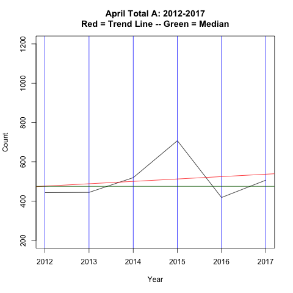

```{r setup, include=FALSE}
suppressMessages(library(flexdashboard))
suppressMessages(library(tidyverse))
suppressMessages(library(ggplot2))
suppressMessages(library(forecast))
```

Page 1
===================================== 
Column {data-width=400}
-------------------------------------
### Total A by Month and Year

```{r}
data <- readRDS("Total_A_M.Rds")
data
```

***
Data from Excel Spreadsheet (Details_Monthly.xls)

Sheets: 2012-2017

Cells: B3:B14

Column {data-width=300}
-------------------------------------
### Overall Statistics

Minimum = 279 (November 2012)

Mean = 598

Median = 567

Maximum = 1107 (July 2014)

Page 2
===================================== 
Column {data-width=200}
-------------------------------------
### Exploratory Data Analysis

```{r}
x <- data
xfit <- seq(200,1200,length = 200)
yfit <- dnorm(xfit,mean = mean(x),sd = sd(x))
hist(x,prob=TRUE,
     xlab = "Total A",
     main = "Distribution of Total A per Month\n2012-2017  (Mean = 598)",
    ylim = c(0,0.0025))
lines(xfit,yfit,col = "red",lwd = 2)
abline(v=598, col = "blue",lwd = 2)
```


Column {data-width=300}
-------------------------------------

```{r}
boxplot(data~cycle(data), names=c("Jan","Feb","Mar","Apr","May","Jun","Jul",
        "Aug","Sep","Oct","Nov","Dec"),
 ylab = "Total Count",
 main = "Total A: January - December (2012-2017)")
```

Page 3
===================================== 
Column {data-width=200}
-------------------------------------
### Time Series Analysis

```{r}
plot(data, main = "Total A: 2012-2017  (Red = Trend Line)",
   xlab = "Year", ylab = "Count")
abline(v = 2012:2017, col = "blue")
abline(lm(data~time(data)),col = "red")      
```


Column {data-width=300}
-------------------------------------

```{r}
decomp<- decompose(data, type="additive") 
plot(decomp)
```

Page 4
===================================== 
Column {data-width=300}
-------------------------------------
### Time Series Forecasts

```{r}
# library(highcharter)
hw_fit <- hw(data, seasonal="additive")
plot(forecast(hw_fit, level = c(80,95)))
# hchart(forecast(hw_fit, level = c(80,95)))
```

Page 5
===================================== 
Column {data-width=350}
-------------------------------------
### Total A trends by month
    
```{r}
TG_Trends <- read.csv("A_Trends.csv")
TG_Trends
TG_Trends$Month_Number <- as.factor(1:12)
TG_Trends$Slope <- ifelse(TG_Trends$Trend_Coeff>=0,"Positive","Negative") 
```

Column {data-width=250}
-------------------------------------
### Trend coefficients by month in descending order 

```{r}
Coeff <- select(TG_Trends,Month,Trend_Coeff,
        Month_Number,Slope)
Coeff <- arrange(Coeff,desc(Trend_Coeff))
Coeff$Month_Number <-as.factor(1:12)
Coeff
```


Page 6
===================================== 
Column {data-width=200}
-------------------------------------

```{r}
ggplot(data=TG_Trends, aes(x=Month_Number, y=Trend_Coeff,fill = Slope)) +
geom_bar(stat="identity",color="black") +
    ggtitle("Trend Lines by Month", 
    subtitle = "2012-2017") +
xlab("Month") + ylab("Linear Regression Trend Line Coeficient") +
scale_x_discrete(labels= c("Jan","Feb","Mar",
"Apr","May","Jun","Jul","Aug","Sep","Oct","Nov","Dec")) +
theme_bw() +
theme(legend.position="none") 
``` 

Column {data-width=250}
-------------------------------------

```{r}
ggplot(data=Coeff, aes(x=Month_Number, y=Trend_Coeff,fill = Slope)) +
geom_bar(stat="identity",color="black") +
    ggtitle("Total A Trend Lines by Month in Descending Order", subtitle = "2012-2017") +
xlab("Month") + ylab("OLS Trend Line Coefficient") +
scale_x_discrete(labels= c("Oct","Feb","Apr",
"Aug","Mar","Sep","Jun","Jul","Nov","Jan","May","Dec")) +
theme_bw() +   
theme(legend.position = "none")   
``` 

Page 7
===================================== 
Column {data-width=300}
-------------------------------------


Column {data-width=300}
-------------------------------------


Page 8
===================================== 
Column {data-width=300}
-------------------------------------


Column {data-width=300}
-------------------------------------



Page 9
===================================== 
Column {data-width=300}
-------------------------------------


Column {data-width=300}
-------------------------------------


Page 10
===================================== 
Column {data-width=300}
-------------------------------------


Column {data-width=300}
-------------------------------------


Page 11
===================================== 
Column {data-width=300}
-------------------------------------


Column {data-width=300}
-------------------------------------


Page 12
===================================== 
Column {data-width=300}
-------------------------------------


Column {data-width=300}
-------------------------------------


